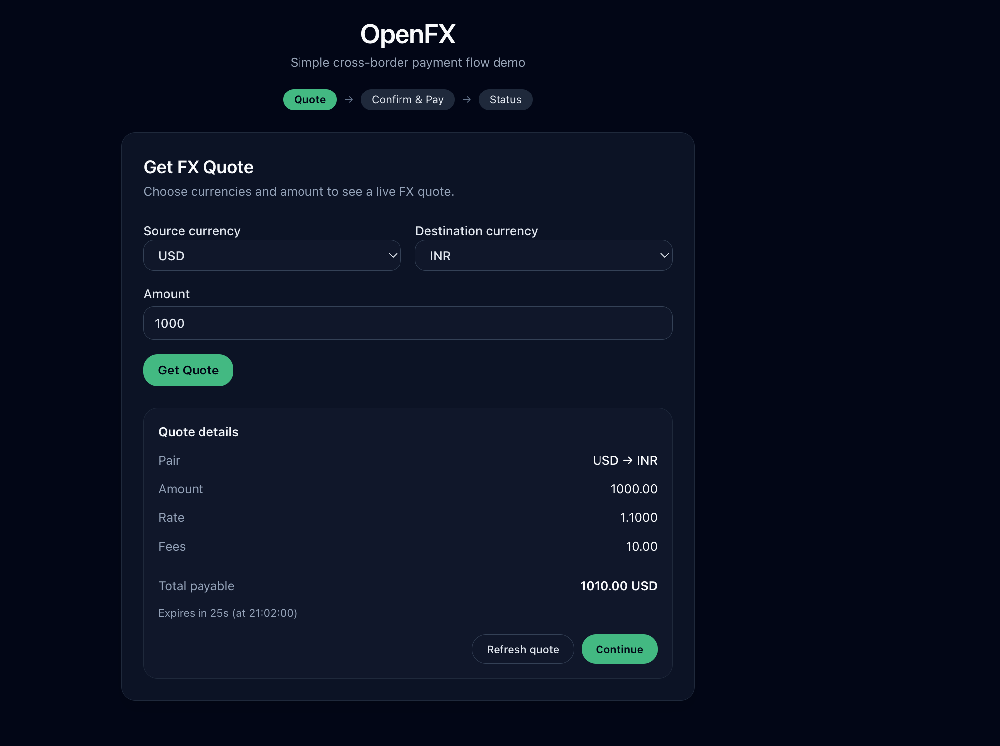
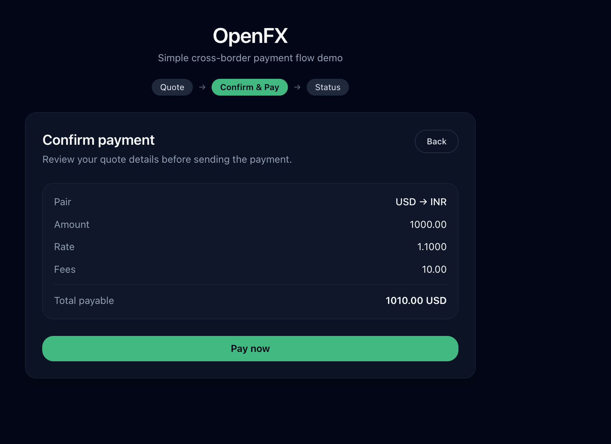
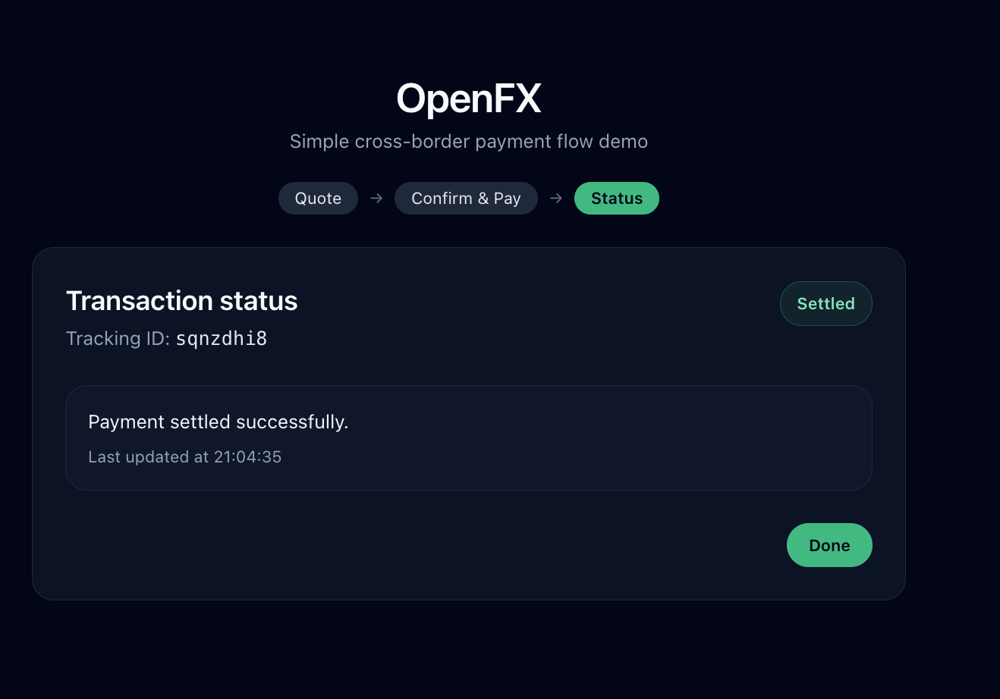

# OpenFX Frontend (Assignment)

Simplified frontend flow for sending money across international corridors:

- Get an FX quote (with expiry)
- Confirm & pay (prevent double submission, handle errors)
- Track transaction status until completion (polling)

## Tech

- React + TypeScript (Vite)
- Tailwind CSS (via `@tailwindcss/vite`)
- Mock API layer (in-memory) to simulate:
  - `POST /quote`
  - `POST /pay`
  - `GET /transaction/:id`

## How to run

Prerequisites:

- Node.js `20.19+` (recommended) or `22.12+`

Install + start:

```bash
npm install
npm run dev
```

Then open:

- http://localhost:5173

## Screenshots

Add these images to the repo (you can commit them):

- `src/assets/images/quote.png`
- `src/assets/images/confirm-pay.png`
- `src/assets/images/transaction-status.png`

And they will render here:

### Quote



### Confirm & Pay



### Transaction Status



## Flow overview

### 1) Quote

- User selects `sourceCurrency`, `destinationCurrency`, and `amount`
- On **Get Quote**, mock API returns rate/fees/total + `expiresAt`
- Visible countdown timer is shown
- **Continue** is disabled after expiry
- **Refresh quote** fetches a new quote (new expiry)

### 2) Confirm & Pay

- Shows quote summary
- **Pay now** triggers `postPay({ quoteId })`
- Prevents double-submit by disabling button while request is in-flight
- Shows loading and error states
- If quote is expired on this screen, payment is blocked and user is guided to go back and refresh

### 3) Transaction Status

- Uses polling to call `getTransaction(transactionId)` periodically
- Displays status clearly: `PROCESSING` → `SENT` → `SETTLED` or `FAILED`
- Polling stops on final state (`SETTLED`/`FAILED`)
- Temporary errors are shown with a manual **Retry now** action

## Key design decisions

- **Three-step flow via local state machine (not URL routing)**
  - Implemented as `step: 'QUOTE' | 'CONFIRM_PAY' | 'STATUS'` in `App.tsx`
  - Kept scope small and predictable while still making user state explicit
  - Can be upgraded to React Router if deep-linking is needed

- **Explicit separation of concerns (screens + API + types)**
  - `src/screens/*` for user-facing steps
  - `src/api/mockApi.ts` to simulate backend behavior
  - `src/types/*` to keep request/response contracts explicit

- **Pessimistic UI for payment**
  - The UI only advances to status after a successful `postPay` response returns a transaction ID
  - Avoids misleading “paid” states

## Tradeoffs

- **No React Router**: simpler and faster to implement; tradeoff is no deep links or browser back/forward integration.
- **Mock API is deterministic**: makes demo stable; tradeoff is fewer real-world edge cases (random failures) unless added.

## What I would improve with more time

- Add tests for:
  - quote expiry countdown
  - pay double-submit prevention
  - status polling stop conditions
- Add more realistic mock behavior:
  - occasional transient network failures
  - occasional `FAILED` transactions
- Extract reusable UI components (`Button`, `Card`, `StatusBadge`) and hooks (`useCountdown`, `usePolling`)
- Accessibility polish (focus states, aria-live for status updates)
